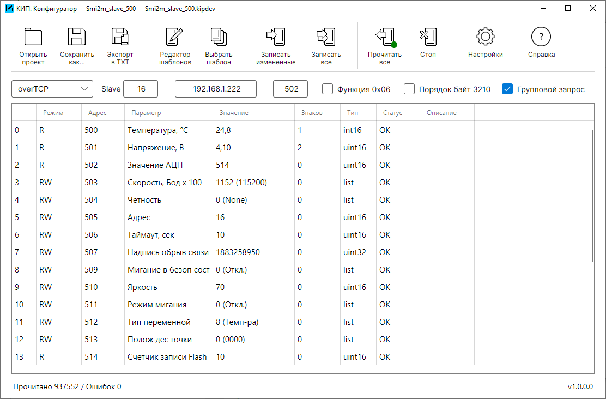

# KipConfigurator

**Инструмент конфигурирования Modbus-устройств**

**КИП. Конфигуратор** — win64 приложение для настройки устройств, работающих по протоколу Modbus. Программа предоставляет интуитивно понятный интерфейс для создания, редактирования и управления конфигурациями, шаблонами и списками значений.

---

## Возможности

### Основной функционал
- **Поддержка нескольких протоколов**: Modbus RTU через последовательный порт, Modbus RTU через TCP, Modbus RTU через UDP и Modbus TCP.
- **Конфигурация устройств**: Создание и редактирование файлов конфигурации устройств (`.kipcfg`).
- **Шаблоны устройств**: Создание и использование многократно применяемых шаблонов (`.kipdev`).
- **Экспорт данных**: Выгрузка таблицы параметров в текстовый файл с разделением табуляцией для формирования документации.

### Управление данными
- **Богатый набор типов данных**: Поддерживаются int16, int32, uint16, uint32, float (real), двоичные, шестнадцатеричные, строки (Windows-1251 и UTF-16BE), а также пользовательские списки.
- **Редактор списков**: Создание выпадающих списков с предопределёнными значениями и описаниями.
- **Валидация ввода**: Проверка данных в реальном времени с визуальной индикацией ошибок.
- **Пакетные операции**: Копирование, вставка, дублирование и изменение порядка параметров.

### Связь с устройством
- **Гибкие настройки подключения**: COM-порты, TCP/IP, UDP с настраиваемыми параметрами.
- **Групповой запрос**: Оптимизация опроса путём группировки смежных регистров.
- **Настраиваемые таймауты**: Регулировка интервалов опроса, таймаутов и количества повторных попыток.
- **Управление порядком байт**: Выбор порядка байт в 32-битных значениях (1032 или 3210).

### Пользовательский интерфейс
- **Поддержка тёмной и светлой темы**: Автоматическая адаптация под системную тему.
- **Drag-and-drop**: Открытие файлов конфигурации и шаблонов перетаскиванием.
- **Индикация состояния**: Отображение статуса и ошибок в реальном времени.
- **Цветовое кодирование строк**: Визуальное выделение изменённых данных, ошибок и разделителей.

---

## Основные окна приложения

| Окно | Описание |
|-----------|----------|
| **Конфигуратор** | Главное окно приложения, содержащее таблицу данных и настройки устройства |
| **Редактор шаблонов** | Редактор шаблонов для создания и редактирования карт регистров |
| **Редактор списков** | Редактор списков для управления переменными типа `list` |
| **Настройки** | Окно настроек приложения (таймауты, задержки, количество повторов) |
| **Справка** | Справка с подробным описанием типов данных, режимов и кодов ошибок |

---

## Типы данных

| Тип | Описание |
|-----|----------|
| **uint16** | Беззнаковое 16-битное целое |
| **uint32** | Беззнаковое 32-битное целое |
| **int16** | Знаковое 16-битное целое |
| **int32** | Знаковое 32-битное целое |
| **real** | 32-битное число с плавающей точкой |
| **bin8/bin16/bin32** | Двоичное представление |
| **hex8/hex16/hex32** | Шестнадцатеричное представление |
| **day** | Битовое поле для дней недели (1–7) |
| **string** | Строка в кодировке Windows-1251 |
| **utf-16** | Строка в кодировке UTF-16BE (UCS-2) |
| **list** | Выпадающий список с предопределёнными значениями |

---

## Форматы файлов

| Расширение | Описание |
|------------|----------|
| `.kipcfg` | Файл конфигурации устройства (включает настройки подключения) |
| `.kipdev` | Файл шаблона устройства (только структура параметров) |
| `.kipconf` | Файл настроек приложения |

---

## Установка

### Требования
- [.NET 6.0](https://dotnet.microsoft.com/download/dotnet/6.0) или выше

### Запуск
Запустите собранный исполняемый файл
